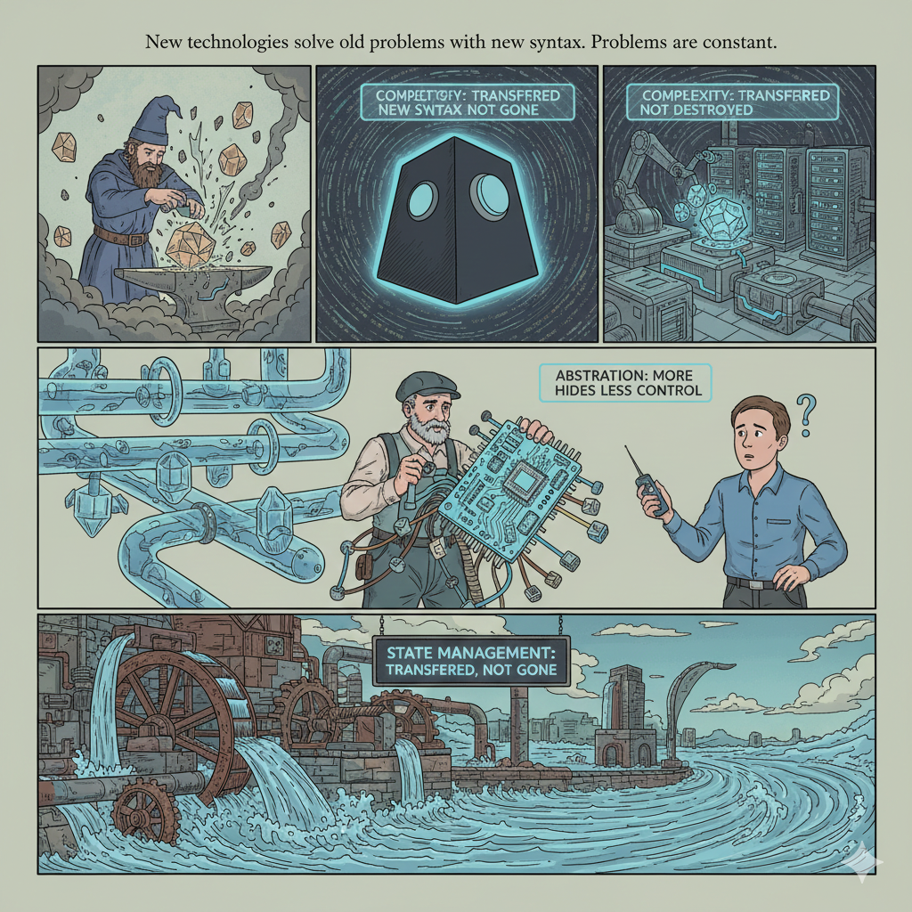
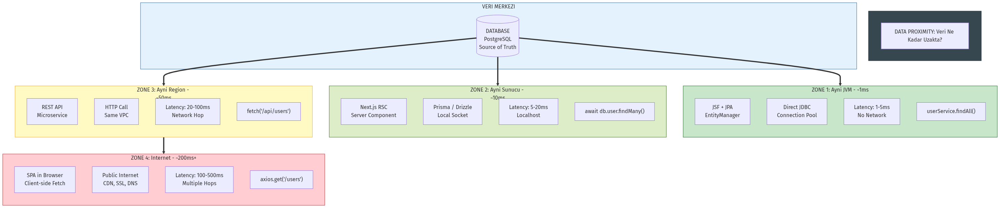

## Dijital Ouroboros {#intro-slide background-image=../../shared/assets/images/pendulum_returns.png" background-size="100% 85%" background-position="center" background-opacity="0.2"}

**Geleceğin Arkeolojisi**

Tarih Tekerrürden İbarettir:  
Sunucudan Ayrılış ve Eve Dönüş

## Ouroboros Nedir?

:::: {.row}

::: {.column width="30%"}
🐍 **Antik Mitoloji Sembolü**

> "Kendi kuyruğunu yiyen yılan"

- Sonsuz döngüyü simgeler
- Kendini yeniden yaratma
- Başlangıç = Son
:::

::: {.column width="70%"}
{width="100%" style="margin-top: 0; margin-left: -50px;"}
:::

::::

**Yazılım dünyası bir Ouroboros'tur.**

## Bu Sunumun Amacı


**İki Temel Hedef:**

**1. Mimari Sarkacın Hareketini Anlamak**

- Her teknolojinin **neden** ortaya çıktığını
- **Hangi problemi** çözdüğünü
- **Hangi yeni problemleri** yarattığını

**2. Gizli Abstraction'ları Görünür Kılmak**

- Magic'in arkasındaki gerçeği göstermek

## Yol Haritamız


## Üç Temel İlke

**DEĞİŞMEYEN HAKİKATLER**

1. **State Management** Asla Kaybolmaz
2. **Abstraction** Arttıkça Kontrol Azalır
3. **Complexity** Yok Edilemez

## İlke 1: State Management

**Asla Kaybolmaz, Sadece Yer Değiştirir**

- **JSF (2006)**: Sunucu RAM'i
- **React SPA (2015)**: Tarayıcı hafızası
- **Next.js (2024)**: Hibrit

**Değişen:** Nerede saklandığı  
**Değişmeyen:** Saklanması gerektiği

## State Saklama Yöntemleri

| Dönem | Yöntem | Teknoloji | Artı | Eksi |
|-------|--------|-----------|------|------|
| 1990'lar | Dosya | Text Files | Basit | Yavaş |
| 2000'ler | RAM | Servlet Session | Hızlı | Uçar |
| 2005-15 | DB | SQL Session | Kalıcı | DB yorar |
| 2010+ | Cache | Redis | Hızlı+Paylaşılır | Ekstra altyapı |
| 2015+ | Client | JWT | Sunucu masrafsız | Logout zor |

**Günümüz:** Redis + JWT kombini

## İlke 2: Abstraction vs Kontrol {#ilke-2-abstraction}

**Abstraction Arttıkça Kontrol Azalır**

- **Düşük** (PHP): Her şey görünür, manuel
- **Orta** (JSF): Lifecycle gizli, yönetilebilir
- **Yüksek** (Modern): "Magic", debug zor

**Tradeoff: Rahatlık ⚖️ Kontrol**

## İlke 3: Complexity Conservation {#ilke-3-complexity}

**Karmaşıklık Yok Edilemez**

> Fizikteki "Enerjinin Korunumu" gibi

- **JSF**: Sunucuda
- **SPA**: İstemcide
- **Modern**: Dağıtıldı

**Sonuç:** En az zarar vereceği yere taşırsınız

## Karmaşıklık Görselleştirmesi



## Backend Developer İçin

**👨‍💻 Sizin İçin:**

- REST API'ler neden **"glue code fabrikası"** oldu?
- N+1 query problemi client'a taşınınca **nasıl katlandı?**
- Server Actions = **RPC'nin modern hali**
- **"Frontend neden bu kadar dosya istiyor?"**

## Frontend Developer İçin

**🎨 Sizin İçin:**

- `useEffect` kaosunun neden kaçınılmaz olduğu
- **JSF'in bunu 20 yıl önce nasıl çözdüğü**
- Redux karmaşıklığı = **state'in yanlış yerde tutulması**
- Server Components = **"geri adım" değil, "yukarı çıkış"**

## Mobile Developer İçin

**📱 Sizin İçin:**

- Web **"her tıklamada sunucuya git"** problemini neden yeniden kucakladı
- Offline-first neden **hala zor**
- **over-fetching vs under-fetching**
- BFF pattern mobil için **kritik**

## Fullstack Developer İçin

**🔧 Sizin İçin:**

> "Her iki tarafı da biliyorum ama neden yoruluyorum?"

- JSF'in tek stack avantajını modern tooling ile **geri kazanma**
- tRPC/Server Actions ile **uçtan uca tip güvenliği**
- Mimari seçimler: **hız, güvenlik, bakım maliyeti**

## PHP Çağı (2000-2005)

**2000'lerin Web'i:**

- İnternet: 56k modem
- E-ticaret patlaması
- Basit CRUD uygulamaları
- Güvenlik henüz öncelik değil

## PHP: Tek Dosya Felsefesi

**Güçlü Yönler:**
- Hızlı geliştirme
- Düşük öğrenme eğrisi
- FTP yeterli

**Zayıf Yönler:**
- SQL Injection
- 5000 satırlık dosyalar
- Separation yok
- Tip güvenliği yok

## Neden Yeterli Değildi?

**2005'e Gelindiğinde:**

- Banka sistemleri
- Kurumsal ERP'ler
- Güvenlik **kritik** hale geldi

**Enterprise Sorusu:**  
"PHP basitliği + Java güvenliği?"

**Cevap: JSF**

## Mimari Sarkaç


**Yazılım doğrusal ilerlemez, sarkaç gibi salınır**

## Aydınlanma Anı

**Dün (JSF):**  
`h:commandButton` ile sunucudaki Java metodunu çağırırdık

**Bugün (Next.js):**  
`Server Actions` ile sunucudaki TypeScript fonksiyonunu çağırıyoruz

**Fark:** Teknoloji  
**Aynı:** Zihniyet

## Component Ağacı Evrimi


## JSF: Ağaç Sunucuda


**UIViewRoot** sunucu hafızasında

- ✅ Güvenli, DB'ye yakın
- ❌ Sunucu belleği şişer

## React SPA: Ağaç Tarayıcıda

**2010'larda Büyük Taşınma**

Ağacı tarayıcıya (Virtual DOM) taşıdık

**Avantaj:** Sunucu rahatladı, etkileşim hızlandı  
**Bedel:** Telefon ısındı, "Loading..." spinner'ları

## Modern: Ağaç Eve Dönüyor


**React Server Components:**  
Gövde sunucuda, yapraklar tarayıcıda

## JSF'in Kalbi

**Request Processing Lifecycle**

JSF bir 'Sihirli Kutu' değildir.

HTTP'yi Java nesnelerine çeviren **devasa Çeviri Motoru**

## 6 Fazlı Döngü


Her istekte **aynı 6 adım**

Modern framework'lerde `useEffect` karmaşası,  
JSF'te **20 yıldır katı disiplin**

## Lifecycle: Faz 1-3

**Kullanıcı "Giriş" Butonuna Bastı**

1. **Restore View** → UIViewRoot'u bul
2. **Apply Request Values** → HTTP POST'u al
3. **Process Validations** → Kontrol et

## Lifecycle: Faz 4-5

**4. Update Model Values** → Java Bean'e yaz
**5. Invoke Application** → Metodu çalıştır

```java
// Sadece 5. Fazda buraya geliriz!
public String login() {
  // Business Logic
  User u = userService.find(this.username);
  return u != null ? "dashboard" : null;
}
```

**Sizin yazdığınız kod sadece 5. fazda çalışır!**

## Component Tree


Her HTML etiketinin Java nesnesi karşılığı

## Stateful vs Stateless

**Maliyet:**
- 1 Kullanıcı = 10KB RAM
- 100.000 Kullanıcı = **1GB RAM**

**ViewState:** Ağacın durumunu koruyan şifreli string

React'te "Virtual DOM" → JSF bunu **2004'te** yaptı!

## PrimeFaces: jQuery Fabrikası

**Siz yazarsınız:**
```xml
<p:calendar value="#{bean.date}" />
```

**Tarayıcıda oluşur:**
```html
<script>
  PrimeFaces.cw("Calendar", {...})
  // 50+ satır jQuery
</script>
```

PrimeFaces = Java ile konfigüre edilmiş **jQuery fabrikası**

## jQuery Üretimi


## Renderer Mekanizması


**"Write Once, Render Anywhere"**

Logic ≠ Görüntü

## JSF Dengesi

| Verdiği | Aldığı |
|---------|--------|
| HTML/JS yazmadan UI | Sunucu CPU/RAM |
| Otomatik Validasyon | Esneklik kaybı |
| Yüksek Güvenlik | Network trafiği |
| Tip Güvenliği | Öğrenme eğrisi |

## PrimeFaces Devrimi

**Problem: JSF Çıplak**

Temel JSF:
- Pagination yok
- Sorting yok
- AJAX yok

## PrimeFaces DataTable

**12 satırla:**
- ✅ Pagination
- ✅ Sorting
- ✅ Filtering
- ✅ AJAX
- ✅ Row selection

## PrimeFaces AJAX

**Partial Page Rendering**

Kullanıcı input'tan çıkınca:
- AJAX → Sunucu
- Sadece ilgili bileşen güncellenir
- **Sayfa yenilenmez!**

2010'da **SPA benzeri deneyim**

## Enterprise Stack (2010-2015)

**3 dosya:**
1. `Product.java` (Entity)
2. `ProductBean.java` (Logic)
3. `products.xhtml` (View)

React SPA ile aynı özellik: **12 dosya**

## Neden Yetmedi?

**2010'da Ne Değişti?**

📱 **iPhone**

- Mobil trafik %50'yi geçti
- Kullanıcı beklentisi değişti
- "Uygulama gibi" deneyim
- Offline çalışma

## PrimeFaces Neden Yetmedi?

**Teknik:**
- Sınırlı AJAX
- Sunucu bağımlılığı
- Routing yok

**Kültürel (Daha Önemli!):**
- "Java eski" algısı
- JS ekosistemi patlaması
- Startup kültürü
- GitHub momentum

## React'in Vaatleri

**AngularJS (2010):**  
Two-way binding, SPA

**React (2013):**  
Virtual DOM, "UI = f(state)"

**REST API Ideology:**  
Frontend ≠ Backend  
Microservices uyumlu

## SPA Patlaması

**2015-2020 Stack:**

- Frontend: React + Redux + Axios
- API: Spring Boot + REST
- Database: PostgreSQL

## 12 Dosya Problemi

**Özellik:** Kullanıcı listesi göster, düzenle, kaydet

**JSF (2010) - 3 Dosya**

**React SPA (2018) - 12 Dosya**

## Backend: 7 Dosya

1. User.java (Entity)
2. UserDTO.java
3. UserMapper.java
4. UserRepository.java
5. UserService.java
6. UserController.java (REST)
7. SecurityConfig.java (CORS, JWT)

**Ve bu sadece backend!**

## Frontend: 5 Dosya

1. userTypes.ts (Interface)
2. userApi.ts (Axios calls)
3. userSlice.ts (Redux state)
4. UserList.tsx (Component)
5. userActions.ts (Redux actions)

**Toplam: 12 dosya vs 3 dosya**

## Kod: Kullanıcı Kaydet

**JSF (2010):**
```java
@Named @ViewScoped
public class UserBean {
  public void save() {
    service.save(user);
    // View sync
  }
}
```

**Next.js (2024):**
```tsx
'use server'
export async function save(formData) {
  await db.user.create(data);
  revalidatePath('/users');
}
```

**BENZİYOR!**

## Kod: DataTable

**PrimeFaces:** 12 satır, tümü dahil

**TanStack Table:** 70+ satır, manuel pagination

## Glue Code Buzdağı


## File Explosion


## SPA: Kazandıklarımız

**✅ Ne Kazandık?**

- Stateless backend → Sonsuz ölçeklenebilir
- Rich UX → Smooth transitions
- Mobile-ready → API paylaşılabilir
- Ekip bağımsızlığı
- Modern tooling

## SPA: Kaybettiklerimiz

**❌ Ne Kaybettik?**

- Initial bundle: 300KB+ JS
- SEO → Server rendering gerekti
- Waterfall → N+1 client'a taşındı
- Type safety koptu → JSON barrier
- 12 dosya → Kod duplicasyonu

## Modern SSR: Eve Dönüş

**Şapkadan Tavşan**

> "Sunucunun HTML render etmek için iyi bir yer olduğunu" keşfettik

- Zero Bundle (Server Components)
- Direkt Data Access
- Streaming HTML

## Server Components = Modern JSF?

**Benzerlikler:**
1. Sunucuda render
2. DB'ye yakınlık
3. Otomatik serialization
4. Güvenli API keys

**Farklar:**
1. Modern tooling
2. Edge computing
3. Streaming
4. Hybrid

## Closure ile Context

**JSF:** ViewState ile sunucu hafızasında context

**Next.js:** JavaScript **closure** ile context yakalanır

```tsx
async function deleteUser() {
  'use server'
  // userId closure içinde!
  await db.user.delete({ where: { id: userId } })
}
```

## RSC Rendering

**Sunucu:**
- Veritabanına erişir
- HTML üretir
- JSON (RSC Payload) gönderir

**Tarayıcı:**
- JSON'ı alır
- DOM'u günceller
- Interactivity (Event Listeners) ekler

*Hibrit bir dans!*

## Sarkaç Dönüyor


## Data Proximity



**Veriye Yakınlık İlkesi:**  
Mantık veriye ne kadar yakın → performans o kadar yüksek

## N+1 Problemi


## Over/Under Fetching

**REST API Açmazı:**

**Over-fetching:** 20 field gelir, 3 kullanırsınız

**Under-fetching:** Her ilişki için ayrı istek

**Çözüm:** GraphQL veya tRPC

## JSF'den Öğrendiklerimiz

**🎓 Kalıcı Dersler:**

1. Validation sunucuda (Client bonus)
2. State veriye yakın
3. Type safety uçtan uca
4. CSRF koruması (Her form)
5. Lifecycle disiplini

## Modern Stack Tavsiyeleri

| Senaryo | Mimari | Neden? |
|---------|--------|--------|
| Admin Panel | Next.js SSR | Veri yoğun |
| E-ticaret | Next.js Hybrid | SEO + interactivity |
| Dashboard | React SPA | Realtime |
| Landing | Astro Static | Performans |

## Doğru Mimari Seçimi

**Karar Ağacı:**

1. **SEO kritik mi?** → Evet: SSR/SSG / Hayır: SPA
2. **Ekip büyüklüğü?** → 1-3: Tek stack / 5+: Ayrı F/B
3. **UI karmaşıklığı?** → Yüksek: SPA / Orta: Hybrid / Düşük: Static

## Değişenler vs Değişmeyenler

**🔄 Değişenler:**
- XML → JSX
- Java → TypeScript
- Session → JWT → Closure
- WAR → Docker → Edge

**♾️ Değişmeyenler:**
- State yönetimi
- Karmaşıklık korunur
- Veriye yakınlık
- Güvenlik sunucuda

## Gelecek Vizyonu

**🔮 Sıradaki Durak?**

- **WebAssembly:** Rust, Go tarayıcıda
- **Local-first:** SQLite + Sync
- **Edge Computing:** CDN'de kod
- **AI-Aided Dev:** "12 dosya" otomatik

## Spiral Yükseliş


**Eskiye dönmüyoruz**

Her döngüde önceki çözümün öğrendiklerini alıp yeni teknolojiyle harmanlıyoruz

**Bu bir spiral. Yukarı doğru.**

## Teşekkürler

**Sorularınız?**

@halisyilboga
