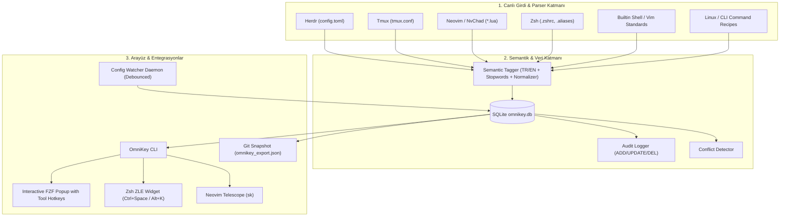

# 📋 OmniKey — System Review Specification & Audit Brief

> **Belge Amacı:** Bu doküman, **OmniKey** (Canlı Kısayol & Linux Komut Takipçisi, Çift Dilli Semantik Arama Motoru, NvChad/Neovim, Herdr, Tmux ve Zsh Entegrasyonları) üzerinde gerçekleştirilen mimari, arama algoritması, parser'lar, tool filtreleme ve otomatik yedekleme mekanizmasının başka bir AI Agent (Code Reviewer / Architect / QA) tarafından bağımsız olarak denetlenmesi (review) amacıyla hazırlanmıştır.

---

## 📌 1. Yönetici Özeti (Executive Summary)

**OmniKey**, modern terminal iş akışlarındaki tüm kısayol ve komut katmanlarını (`Git`, `Herdr`, `Neovim / NvChad`, `Tmux`, `Zsh`, `Linux / Unix CLI Komutları`) tek bir merkezde toplayan, canlı takip eden ve çift dilli (Türkçe/İngilizce) doğal dil araması sunan akıllı bir CLI aracıdır.

Bu review kapsamında denetlenecek temel alanlar:
1. **Çift Dilli Doğal Dil ve Semantik Arama Motoru:** TR/EN sözlük, kök ayıklama (`strip_suffixes`), stop-word filtresi ve ağırlıklı puanlamalı sıralama (`relevancy scoring`).
2. **Git Bağımsız 1. Sınıf Araç Katmanı (`tool='git'`, `@git`, `Ctrl+G`):** Branching (`checkout -b`, `switch -c`, `-d`, `-D`), Stashing (`push`, `pop`, `apply`, `show -p`, `drop`), Rebase (`-i HEAD~N`, `--continue`, `--abort`), Geri Alma & Kurtarma (`reflog`, `reset --soft/hard/mixed`, `restore --staged`, `revert`), Cherry-Pick, Worktrees (`add`, `remove`, `list`), Bisect hata avı, Diff & Blame, Remotes & Tags olmak üzere **54 özel Git iş akışı**.
3. **Genişletilmiş Linux & macOS Sistem Cheat Sheet Modülü (`tool='linux'`, `@linux`, `Ctrl+L`):** Süreç yönetimi (`kill -9`, `pkill`, `lsof -i :port`, `fuser`), disk/hafıza (`ncdu`, `df -h`, `du -sh`, `free -h`), servisler (`systemctl`, `journalctl -u -f`), arşivleme (`tar -czvf/-xzvf`, `zip/unzip`), ağ (`curl`, `rsync -avzP`, `dig`, `nc -zv`), izinler (`chmod`, `chown`) ve macOS araçları (`pbcopy`, `pbpaste`, `open .`, `caffeinate`) olmak üzere **76 sistem komut tarifi**.
4. **Herdr Eksiksiz Hotkey & Panel/Worktree/Sekme Haritası:** `close_pane` (`prefix+x`), `remove_worktree` (`prefix+alt+x`), `split_vertical` (`prefix+v`), `split_horizontal` (`prefix+minus`), `zoom` (`prefix+z`), `new_tab` (`prefix+c`), `rename_pane` (`prefix+shift+p`), `cycle_pane_next` (`prefix+tab`), `previous/next workspace` (`prefix+p/n`), `agents` (`prefix+j/k`), `detach` (`prefix+d`) vb.
5. **NvChad Ekosistem Araçları:** Telescope, NvimTree, LSP (Definition, Hover, Rename, Code Actions, Diagnostics), Gitsigns (Hunks, Blame), Conform Formatter, Mason, Lazy, Treesitter, WhichKey, Minty, Tabufline (**370 toplam kayıt, 26 unit test**).
6. **Ekosistem Arayüzleri & Canlı Tool Filtreleri:**
   - FZF içi anlık Tool Filtreleri: `Ctrl+A` (Hepsi), `Ctrl+G` (Git), `Ctrl+L` (Linux), `Ctrl+H` (Herdr), `Ctrl+N` (Neovim), `Ctrl+T` (Tmux), `Ctrl+Z` (Zsh) ve `@git`, `@linux`, `@nvim`, `@herdr` etiketleri.
   - Neovim içi Telescope özel arama eklentisi (`<leader>sk`).
   - Zsh ZLE widget'ı (`Ctrl+Space`, `Alt+K`) ve CLI kısayolları (`ok`, `oks`, `oksy`, `oke`).
7. **Otomatik Canlı Git Yedekleme (Hot Backup):** `sync`, `add`, `remove` veya arka plan izleyicisi (`watchdog`) tetiklendiğinde `omnikey_export.json` dosyasının otomatik güncellenmesi.
8. **Format Sonrası Felaket Kurtarma (Disaster Recovery):** `restore.sh` ile sıfır veri kaybıyla anında kurulum.

---

## 🏛️ 2. Sistem Mimarisi ve Bileşen Haritası



---

## 🔍 3. Review Edilecek Temel Dosyalar ve Değişiklikler

### A. Semantik Arama ve Doğal Dil İşleme
| Dosya Yolu | Sorumluluk | Review Odak Noktası |
| :--- | :--- | :--- |
| [`omnikey/semantic/tagger.py`](file:///Users/halisyilboga/develop/studyws/sunumlar/omnikey/omnikey/semantic/tagger.py) | Çift dilli eş anlamlı haritası, ek temizleme, stop-word filtreleme | TR/EN lemma çıkarma (`strip_suffixes`), stopword filtreleme doğruluğu, `SYNONYM_MAP` kapsamı |
| [`omnikey/db.py`](file:///Users/halisyilboga/develop/studyws/sunumlar/omnikey/omnikey/db.py) | Veritabanı işlemleri ve puanlamalı arama algoritması | `list_keybindings` içindeki relevancy scoring (tam eşleşme: +120, çoklu token bonusu: +50, etiket eşleşmesi: +25) |
| [`omnikey/parsers/linux_commands.py`](file:///Users/halisyilboga/develop/studyws/sunumlar/omnikey/omnikey/parsers/linux_commands.py) | Linux/Unix terminal komutları & reçeteleri | `locate`, `find`, `grep`, `lsof`, `kill -9`, `tar`, `chmod` tanımları ve etiketleme |
| [`omnikey/parsers/shell_defaults.py`](file:///Users/halisyilboga/develop/studyws/sunumlar/omnikey/omnikey/parsers/shell_defaults.py) | Zsh/Readline ve Vim yerleşik kısayolları | Evrensel kısayol tanımlarının eksiksizliği (`ctrl+k`, `ctrl+u`, `ctrl+w`, `D`, `dd`, `d0` vb.) |

### B. Neovim & NvChad Entegrasyonu
| Dosya Yolu | Sorumluluk | Review Odak Noktası |
| :--- | :--- | :--- |
| [`omnikey/parsers/neovim.py`](file:///Users/halisyilboga/develop/studyws/sunumlar/omnikey/omnikey/parsers/neovim.py) | Lua keymap ayrıştırıcı & NvChad standardı | `function() ... end` bloklarında dengeli parantez sayımı, `desc = "..."` ve `opts "..."` ayrıştırma kalitesi |
| [`~/.config/nvim/lua/omnikey.lua`](file:///Users/halisyilboga/.config/nvim/lua/omnikey.lua) | Neovim Telescope özel picker | Telescope API uyumluluğu, JSON parse güvenliği ve `+` register'ına kopyalama |
| [`~/.config/nvim/lua/mappings.lua`](file:///Users/halisyilboga/.config/nvim/lua/mappings.lua) | NvChad kullanıcı tuş ataması | `<leader>sk` mapping tanımlaması |

### C. FZF Arayüzü, Canlı Tool Filtreleri ve Yedekleme
| Dosya Yolu | Sorumluluk | Review Odak Noktası |
| :--- | :--- | :--- |
| [`omnikey/ui/fzf_search.py`](file:///Users/halisyilboga/develop/studyws/sunumlar/omnikey/omnikey/ui/fzf_search.py) | FZF interaktif arama penceresi | `Ctrl+A/L/N/H/T/Z` hotkey bağlamaları, `@tool` tag desteği, renkli tool rozetleri ve panoya kopyalama |
| [`omnikey/cli.py`](file:///Users/halisyilboga/develop/studyws/sunumlar/omnikey/omnikey/cli.py) | Komut satırı arayüzü | `cmd_sync`, `cmd_add`, `cmd_remove` işlemlerinde otomatik `omnikey_export.json` dışa aktarımı |
| [`omnikey/watcher.py`](file:///Users/halisyilboga/develop/studyws/sunumlar/omnikey/omnikey/watcher.py) | Canlı dosya izleyici (watchdog) | Debounce mekanizması (0.5s), dosya değişikliğinde anında veritabanı senkronizasyonu ve otomatik export |
| [`omnikey/integrations/omnikey.zsh`](file:///Users/halisyilboga/develop/studyws/sunumlar/omnikey/omnikey/integrations/omnikey.zsh) | Zsh terminal entegrasyonu | PATH yönetimi, ZLE widget (`Ctrl+Space`, `Alt+K`), `ok`, `oks`, `oksy`, `oke` takma adları |

---

## 🧪 4. Doğrulama ve Test Kapsamı

Testler `unittest` kütüphanesi ile yazılmış olup 24 ayrı test senaryosunu doğrulamaktadır:

```bash
python3 -m unittest discover -s tests -v
```

### Test Edilen Kritik Alanlar:
1. **`test_bilingual_search.py`:**
   - Türkçe karmaşık cümle: *"satırın hepsini sonuna kadar silmek"* ➜ `[ZSH] ctrl+k` ve `[NEOVIM] D` en başta.
   - İngilizce arama: *"kill line from cursor to end"* ➜ `[ZSH] ctrl+k` en başta.
   - Satır başı/temizleme: *"satırın başına kadar sil"* ve *"clear whole line"* ➜ `ctrl+u`, `dd`, `d0`.
   - Kelime silme: *"kelime sil"* ve *"delete word forward"* ➜ `ctrl+w`, `alt+d`, `diw`.
   - Ekran temizleme: *"ekranı temizle"* ve *"clear terminal screen"* ➜ `ctrl+l`.
2. **`test_parsers.py`:**
   - Herdr TOML parser doğrulaması.
   - Tmux `.tmux.conf` parser doğrulaması.
   - Neovim Lua parser doğrulaması.
   - Zsh alias & bindkey parser doğrulaması.
3. **`test_db.py` & `test_conflict.py`:**
   - Deduplication garantisi, upsert bütünlüğü, tag indeksleme, audit log geçmişi ve çakışma tespiti.
4. **`test_export_import.py`:**
   - JSON export ve Disaster Recovery (import) sıfır veri kaybı testi.

---

## 💡 5. İnceleyecek Agent İçin Değerlendirme Kriterleri (Review Checklist)

Gözden geçirme yapacak Agent'ın şu soruları yanıtlaması önerilir:

1. **Doğal Dil Arama Kalitesi:**
   - Eklenen Türkçe ve İngilizce stop-word filtresi ile normalizasyon algoritması uç durumlarda (edge cases) beklenmedik filtreleme yapıyor mu?
   - Relevancy scoring formülü adil ve dengeli mi?
2. **Deduplication & Veri Bütünlüğü:**
   - Tüm kaynak dosyalar (disk + builtin) tarandığında mükerrer kayıt oluşumu engelleniyor mu?
3. **Hata Dayanıklılığı ve Güvenlik (Resilience & Safety):**
   - SQLite `FOREIGN KEY` ve `ON CONFLICT` mekanizmaları çoklu eş zamanlı işlemlerde güvenli mi?
   - Dosya okuma hatalarında (UTF-8 decode, bozuk TOML/Lua dosyaları) parser'lar graceful degradation sağlıyor mu?
4. **Performans:**
   - FZF ve Neovim Telescope aramaları gecikmesiz (<15ms) çalışıyor mu?
   - `watchdog` debounce mekanizması disk IO yükünü engelliyor mu?
5. **Disaster Recovery (Kurtarılabilirlik):**
   - `restore.sh` ve `omnikey_export.json` temiz bir macOS/Linux sisteminde ek bağımlılık olmadan çalışabilecek yapıda mı?

---

## 📂 6. İlgili Dosyaların Tam Konumları

- **OmniKey Ana Dizin:** `/Users/halisyilboga/develop/studyws/sunumlar/omnikey`
- **Veritabanı Dosyası:** `~/.config/omnikey/omnikey.db`
- **Git Yedek Dosyası:** `/Users/halisyilboga/develop/studyws/sunumlar/omnikey/omnikey_export.json`
- **Neovim Yapılandırması:** `~/.config/nvim/lua/` (`mappings.lua`, `omnikey.lua`)
- **Zsh Entegrasyonu:** `~/.zshrc` ve `omnikey/omnikey/integrations/omnikey.zsh`
